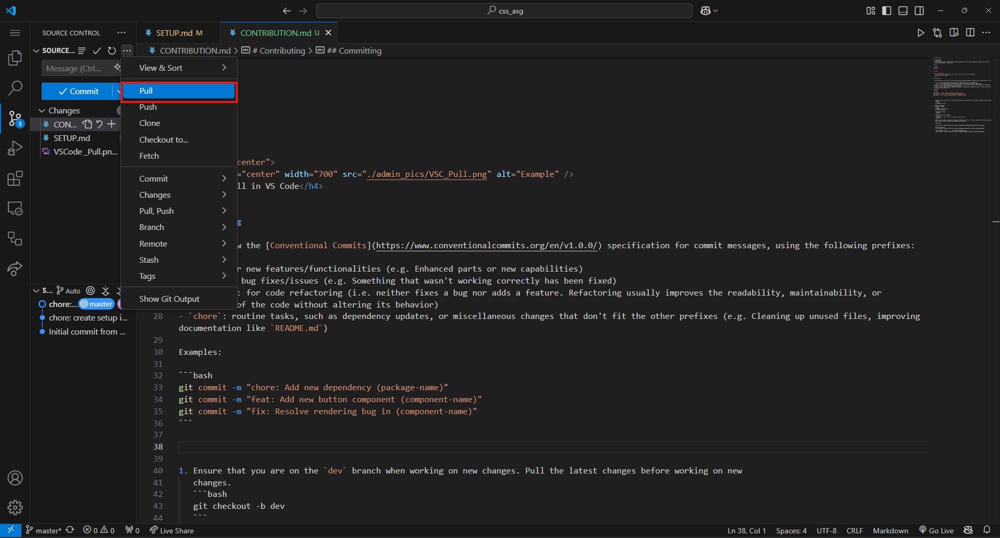
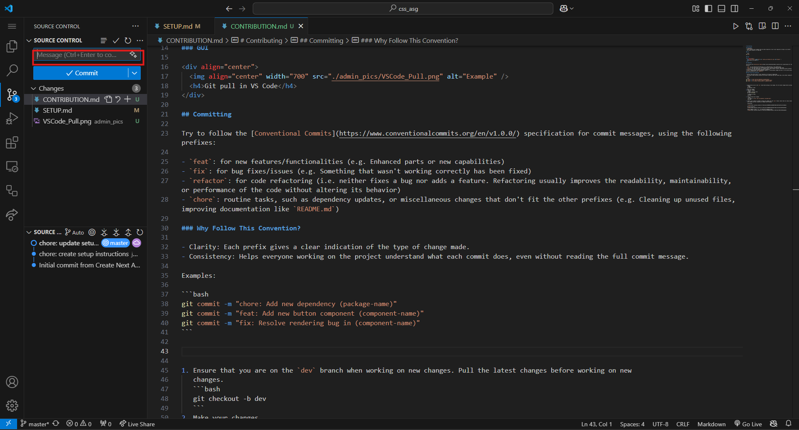
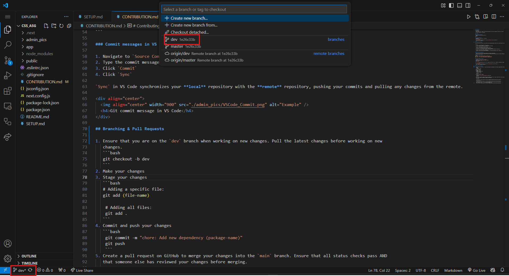
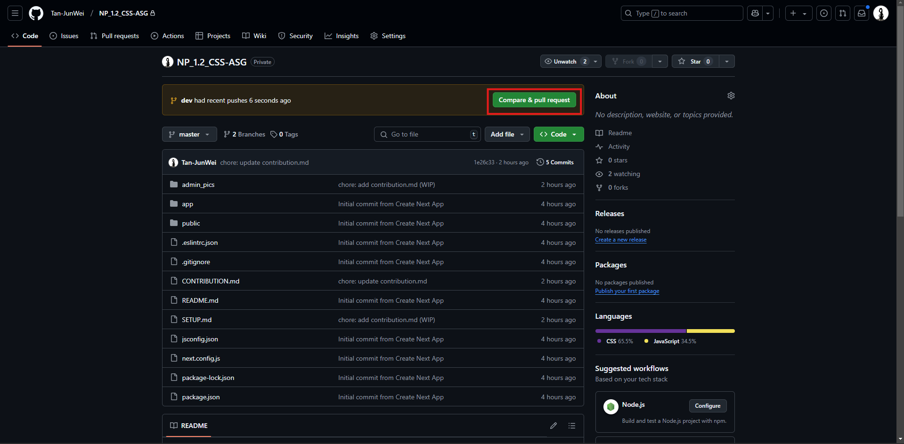

# Contributing

## Development
> [!IMPORTANT]
> Please regularly pull changes from the remote repository to your local repository to keep it up to date!!
> 
> Use either terminal or VS Code GUI

## Git Pull

### CLI Approach (Terminal)
- Navigate to correct directory then run:
```bash
git pull
```

### VS Code GUI Approach
-  Navigate to `Source Control` in VS Code
-  Click `Pull`
<div align="center">
  
  <h4>Git pull in VS Code</h4>
</div>

## Committing (Git Commit)

Try to follow the [Conventional Commits](https://www.conventionalcommits.org/en/v1.0.0/) specification for commit messages, using the following prefixes:

> [!TIP]
>
>- **`feat`**: For new features or functionalities  
  _Example: Adding new capabilities or enhancing parts of the app_
>
>- **`fix`**: For bug fixes or resolving issues  
  _Example: Fixing something that wasn't working correctly_
>
>- **`refactor`**: For improving code without changing its behavior  
  _Example: Refactoring for better readability or performance (no new features or bug fixes)_
>
>- **`chore`**: For routine tasks or maintenance  
  _Example: Cleaning up files, updating dependencies, or improving documentation (like `README.md`)_


### Why Follow This Convention?

- Clarity: Each prefix gives a clear indication of the type of change made.
- Consistency: Helps everyone working on the project understand what each commit does, even without reading the full commit message.

### Commit messages examples
```bash
git commit -m "chore: Add new dependency (package-name)"
git commit -m "feat: Add new button component (component-name)"
git commit -m "fix: Resolve rendering bug in (component-name)"
```

### Commit messages in VS Code

1. Navigate to `Source Control` in VS Code
2. Type the commit message in the `Message` field
3. Click `Commit`
4. Click `Sync`

`Sync` in VS Code synchronizes your **local** repository with the **remote** repository, pushing your commits and pulling any changes from the remote.

<div align="center">
  
  <h4>Git commit message in VS Code</h4>
</div>

## Branching & Pull Requests 

1. Ensure that you are on the `dev` branch when working on new changes. Pull (`git pull`) the latest changes before working on new
   changes.
<div align="center">
  
  <h4>dev Branch check</h4>
</div>

> [!IMPORTANT]
> - Refer to image above above, bottom left corner should show `dev` instead of `master` when you're working on a feature (Good practice to not work directly on main/master branch)
> - Remember to `git pull` before you work on your features

2. Make your changes

3. Stage your changes
  ```bash
  # To add a specific file:
  git add <file-name>

  # To add all files that have been changed:
  git add .
  ```
  
  - You may skip this step if you're using VS Code GUI. 

4. Commit and push your changes
  ```bash
  git commit -m "feat: add navigation bar"
  git push
  ```

  - If you're using VS Code GUI, ensure that you enter an appropriate git commit message in the `Message` field. Then click `Commit` and subsequently `Sync`.

5. Create a pull request (PR) on GitHub to merge your changes into the `main` branch. Ensure that all status checks pass.
  
  #### Creating PR
  <div align="center">
    
    <h4>Compare and Create PR in GitHub</h4>
  </div>

  <div align="center">
    
    <h4>Creating PR (can add description if the feature you're working on is complicated)</h4>
  </div>

  <div align="center">
    
    <h4>Merge PR</h4>
  </div>

  <div align="center">
    
    <h4>PR merged successfully</h4>
  </div>

### Merge Conflicts
> [CAUTION] 
> Merge conflicts may occur when 2 (or more) parties modify the same part of the code in conflicting ways. 
> During a merge conflict, GitHub/Git will highlight the conflicting code in the file(s).

Example conflict message: 
```
This branch has conflicts that must be resolved.
```

### Steps to resolve conflicts in GitHub
1. In the PR, click `Resolve Conflicts`.

2. Decide which version to keep, or try to merge changes. Remove the conflict markers (`<<<<<<<`, `=======`, `>>>>>>>`).

3. Once you've resolved the conflict, click `Mark as Resolved`. 

4. After marking the conflict as resolved, GitHub prompts you to commit the resolution. Click `Commit Merge` to finalize.

5. If all conflicts are resolved and status checks pass, you can now merge the PR.


This is what ChatGPT says (We're so cooked):

<div align="center">
  
  <h4>PR merged successfully</h4>
</div>