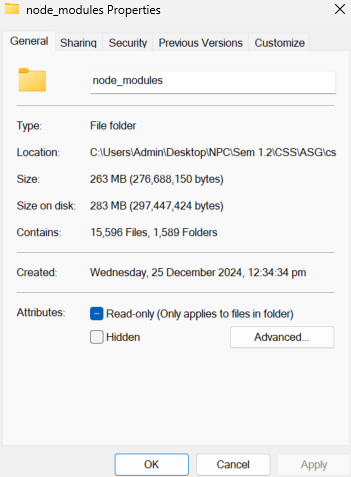

## Getting Started
This is just some instructions before we get started on the project, please follow step by step.

### Installation
1. Clone this repository in a directory of your choice
    ```bash
    git clone https://github.com/Tan-JunWei/NP_1.2_CSS-ASG.git
    cd NP_1.2_CSS-ASG
    ```

2. Install necessary dependencies
    ```bash
    npm install
    ```

3. Check that you have successfully installed dependencies
    - Navigate to directory
    - Right click `node_modules` folder > `properties`
    - You should see `15,596` Files and `1,589` Folders
<div align="center">
  
  <h4>node_modules</h4>
</div>

4. Run the following command to check if you are able to access default next.js application page
    ```bash
    npm run dev
    ```

5. If you are able to execute each step correctly, yippee!

6. Please wait patiently until I create another file (`CONTRIBUTION.md`) to streamline development processes 😳.